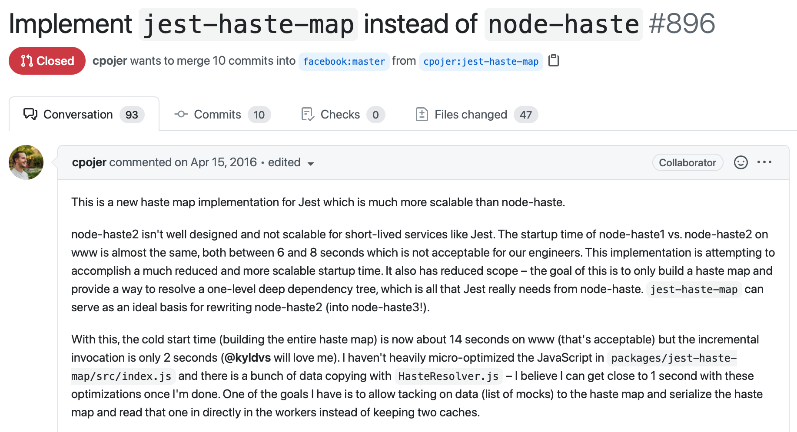
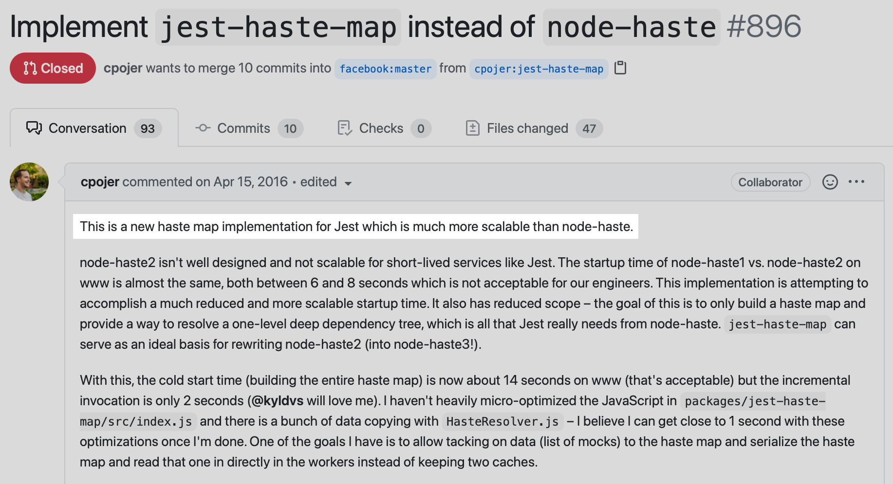
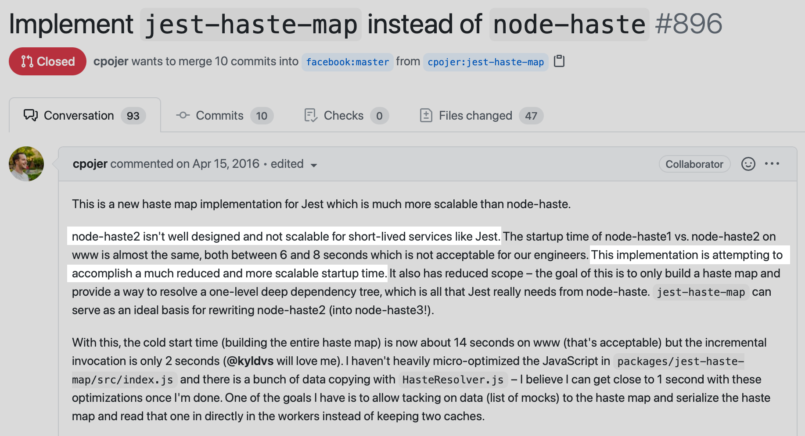
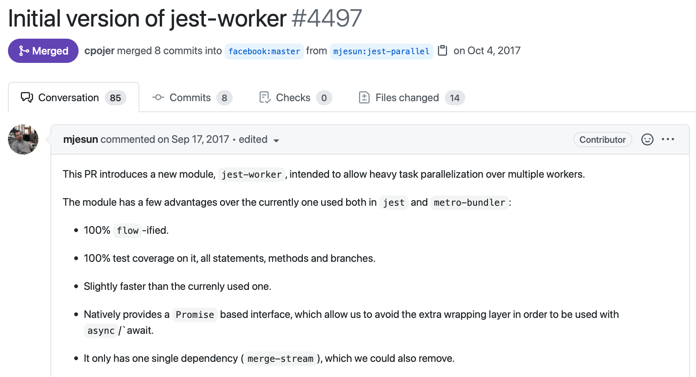
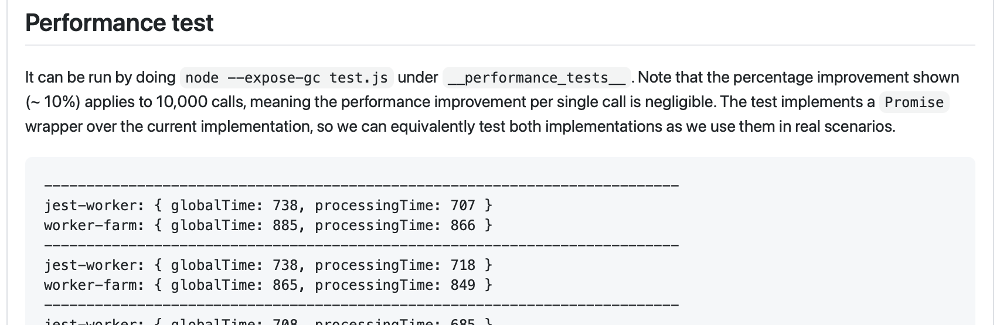
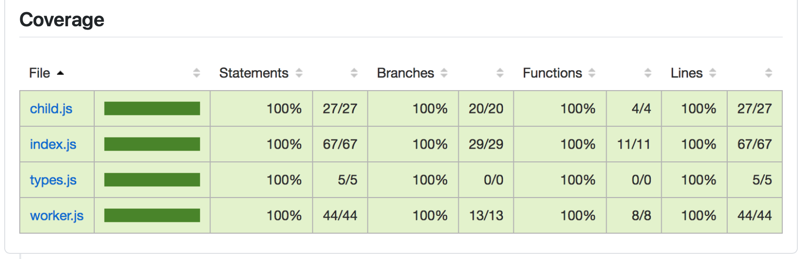
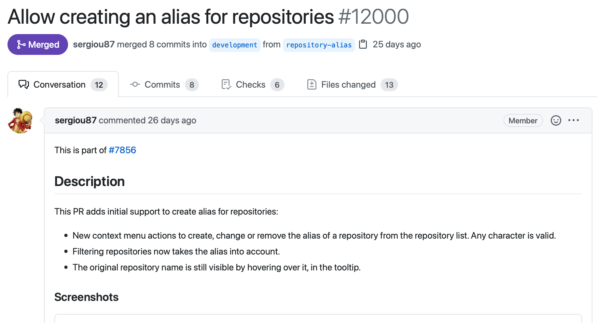

autoscale: true
footer: *© 2021 Justin Spahr-Summers, [available](https://github.com/jspahrsummers/effective-code-review) under [CC BY 4.0](https://creativecommons.org/licenses/by/4.0/) license*
build-lists: true
theme: Ostrich, 1

# **Effective**
# [fit] Code Review

^ Code review is a key part of the software engineering process. I'm going to be talking to you today about making code reviews as effective as possible.

---

# [fit] [Justin Spahr-Summers](https://jspahrsummers.com)
## _@jspahrsummers_

[.hide-footer]

^ Let me introduce myself. My name is Justin Spahr-Summers, a.k.a., [@jspahrsummers](https://jspahrsummers.com) on basically every platform.

---

 

   

[.hide-footer]

^ I've worked at smaller companies and larger ones, and been a key contributor to several successful open source projects in the Cocoa community, including Carthage, ReactiveCocoa, the Squirrel update framework, and the Mantle model framework for Objective-C.

^ In total, I've done thousands of code reviews—possibly even _tens_ of thousands—in both commercial and open source contexts.

---

# [fit] Code review puts the **engineering**
# [fit] into **software engineering**

^ Why this talk?

^ Code review is _fundamental_ to our discipline. Without code review (and without other key fundamentals like testing, or CS theory), we're just _programming_—not engineering. We elevate our craft, and hold each other to a higher standard, through peer reviews.

---

# _Poor quality_ reviews...

- Waste everyone's time today
- Waste everyone's time in the future
- Provide a false sense of security

^ Many (I daresay _most_) teams are already doing some kind of code review. But if it's not _effective_, what's the point?

^ If your reviews aren't preventing technical debt, aren't improving the end result, and don't provoke good conversation… it's just burning everyone's time for little benefit.

---

# **Great** reviews...

- Minimize technical debt
- Improve the architecture
- Share domain knowledge
- Provide teaching opportunities

^ Submitting a pull request should be the _start_ of a conversation, not the end of one. Use code reviews to achieve all of these goals, and really dig deep into the essence of what you're trying to achieve. The result will benefit everyone!

^ I intentionally do not say that "great reviews prevent bugs." I think bugs should be _primarily_ prevented through type systems, tests, etc., and not rely upon humans to catch before merging. But of course, some reviews will indeed catch some number of bugs.

---

# First
# [fit] principles

^ Before deciding on or describing any process, I like to identify the first principles. Process should follow principles, not the other way around.

^ For code review, these are…

---

## **Good code review**
## [fit] starts from the same perspective as
## writing **good code**
## [fit] *if we were to write the best version of this, what would it be?*

^ A great code reviewer is a great engineer, because being able to dig in and understanding someone else's code, as well as how to _improve_ it, are required all the time in writing code too!

^ Note that it doesn't work the other way—not all great engineers are automatically great reviewers! It's an additional skill, and requires commitment to become good at.

---

# [fit] **Unblock** others
## [fit] _Increase your team's productivity_

^ One of the most impactful things you can do is unblock your colleagues. PRs sitting open and unreviewed = lower productivity for everyone.

^ I recommend establishing a maximum turnaround time for code reviews (e.g., 24 hours during the working week). If you're having trouble context switching, or bouncing back and forth between reviews and your own coding, establish a few recurring review times as a habit—like before starting your day, after lunch, at the end of your day

---

# [fit] Critique the **code**
## *(not the person)*

^ You may have heard the expression, "you are not your code." I prefer this reversal of it.

^ The code that someone submits should not reflect upon them _as a person_. Code reviews should never make it personal. It should be about the problem we're trying to solve, and whether this particular version of the change is the best way to do it.

---

# [fit] Don't assume it's **obvious**
## [fit] _Code changes and feedback both need explanation_

^ Many, many important things get omitted in communication because someone assumed, "this is obvious, I don't need to say it."

^ **Always** state your assumptions, and overcommunicate. Code authors, explain what you're doing and why! Code reviewers, explain the feedback you give, and why you believe it might help!

---

^ TODO: Better linking before this slide?

# The
# [fit] process

^ Okay. Let me share the process that I use—the one I've honed over thousands of code reviews.

---

# [fit] _Start at the highest level, then dive deeper..._

1. [Intent](#intent)
1. [Design](#design)
1. [Behavior](#behavior)

^ I approach code reviewing in stages, "outside-in."

^ By starting at the highest level, I can short-circuit my review if I reveal anything that might necessitate a major change to the pull request. There's little point in reviewing each line of code if the architecture is all wrong!

---

# _**1.** Intent_
<a name="intent" />

^ Let's start with the _intention_ behind the change, and make sure we agree on what we want this PR to actually accomplish.

---

# [fit] What is the **goal**?
## _Is the explanation clear?_

^ **Every single pull request summary** should explain the goal of the PR. Otherwise, how will you as a reviewer know whether it's acceptable?

^ The author of a pull request will almost always have the _most_ context on the problem, so it's also important that they can explain it clearly. If the explanation doesn't make sense to you as a reviewer, request changes!

---

[.hide-footer]

^ Here's a clear and informative pull request summary from the Jest project (testing for JavaScript), from [Christoph Nakazawa](https://cpojer.net).

^ https://github.com/facebook/jest/pull/896

---

[.hide-footer]

^ The very first sentence gives you the goal right away—to introduce "a new haste map implementation … which is much more scalable than node-haste." There's some assumed context here, but in this case, it refers to something all of the reviewers will be familiar with.

^ https://github.com/facebook/jest/pull/896

---

[.hide-footer]

^ Then, the summary elaborates on why that goal is important. The existing implementation "isn't well designed and not scalable." "This implementation is attempting to [reduce] startup time."

^ Boom. Reviewers now have enough information to evaluate:
1. Whether the goal is worth achieving (i.e., if this is the right problem to solve)
2. If so, whether this particular PR achieves it

^ https://github.com/facebook/jest/pull/896

---

# [fit] Does it **succeed**?
## _How do you know?_

^ Is it tested? How will you know if it regresses?

---

[.hide-footer]

^ https://github.com/facebook/jest/pull/4497

---

[.hide-footer]

^ https://github.com/facebook/jest/pull/4497

---

[.hide-footer]

^ https://github.com/facebook/jest/pull/4497

---

# _A good summary should include..._

- Background context
- What the bug or feature is
- What the change achieves
- How the change is tested
- Known limitations or anything still missing
- **Request changes** if the summary is incomplete!

---

[.hide-footer]

^ https://github.com/desktop/desktop/pull/12000

---

[.hide-footer]

^ https://github.com/desktop/desktop/pull/12000

---

# [fit] Are the changes
# **appropriate**?

^ Do they align with the explanation in the summary? Are major architectural shifts explained? Do other changes depend on this one? Even incomplete PRs should meet a high quality bar.

---

# _**2.** Design_
<a name="design" />

---

# Ask yourself:
# [fit] How would **you** do it?

^ Try to think through the bug or feature described, and mentally design your own solution for it.
^ If you didn't have this PR in front of you, how would you have done it? Does that highlight any gaps in the code you're reviewing?

---

# Review the **architecture**
### _(The components and how they relate to one another)_

- Do you understand it well enough to use or extend?
- Are the architectural choices justified?
- Would everyone else be happy to maintain this?

---

# Review the **API**
### _(The contract for using each component)_

- Is the API understandable without the PR?
- Does the documentation teach the reader how to use it?
- Is the API conventional?

---

# Is the design **good**?

---

# **[YAGNI](https://en.wikipedia.org/wiki/You_aren%27t_gonna_need_it)**
# [fit] _You aren't gonna need it_

---

# [fit] **[Simple](https://www.infoq.com/presentations/Simple-Made-Easy/)** vs. easy

---

# **[Pit of success](https://blog.codinghorror.com/falling-into-the-pit-of-success/)**
# [fit] _Make the right things easy_
# [fit] _& the wrong things possible_

---

# **[SOLID](https://en.wikipedia.org/wiki/SOLID)** principles

[.column]

- [Single-responsibility principle](https://en.wikipedia.org/wiki/Single-responsibility_principle)
_each thing should have **only one responsibility**_

- [Open–closed principle](https://en.wikipedia.org/wiki/Open–closed_principle)
_**behavior should be extensible** without modifying code_

- [Liskov substitution principle](https://en.wikipedia.org/wiki/Liskov_substitution_principle)
_**types should be replaceable** with subtypes_

[.column]

- [Interface segregation principle](https://en.wikipedia.org/wiki/Interface_segregation_principle)
_**many specific interfaces** are better than one über-interface_

- [Dependency inversion principle](https://en.wikipedia.org/wiki/Dependency_inversion_principle)
_**depend upon abstractions**, not concrete implementations_

---

# _**3.** Behavior_
<a name="design" />

---

# Review the **tests**

- Tests should be documentation
- Tests should protect against regressions
- Tests should validate the API contract
- Tests need to be understandable
- Are there missing tests?
- You can **request changes**!

---

# Review the **implementation**

- This is the **least important** part to review!
- Would you be able to debug this code?
- [DRY](https://en.wikipedia.org/wiki/Don't_repeat_yourself): Don't repeat yourself
- Don't reinvent the wheel
- Don't ignore linters and warnings
- If it looks convoluted, it's probably wrong

^ Does the code achieve its goal in the simplest, most maintainable way possible?

---

# _But remember..._

1. [Intent](#intent)
1. [Design](#design)
1. [Behavior](#behavior)

---

# Other
# [fit] ProTips™

---

# Give effective **feedback**

- Always **request changes** or **accept**
- Be pragmatic for urgent changes
- Is each stage of review important right now?
- Solicit second opinions
- Prioritize your feedback
- Provide concrete suggestions

---

# **Tell a story** with your commits

- Each commit should build logically upon the previous
- Clean up after yourself:
`git rebase -i`
`hg histedit`
 
- [Stack](http://bentrengrove.com/blog/2020/7/8/how-to-stack-prs-in-github) dependent changes

---

# _Questions?_

**Slides and notes** are available at:
[github.com/jspahrsummers/effective-code-review](https://github.com/jspahrsummers/effective-code-review)

Thanks to Lightricks and Barak Yoresh for inviting me to speak!
